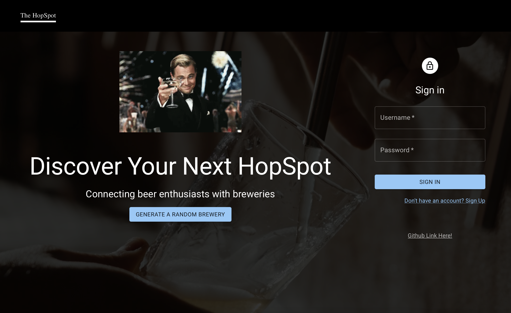
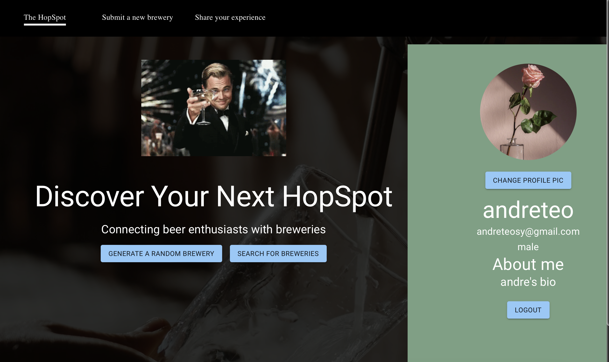
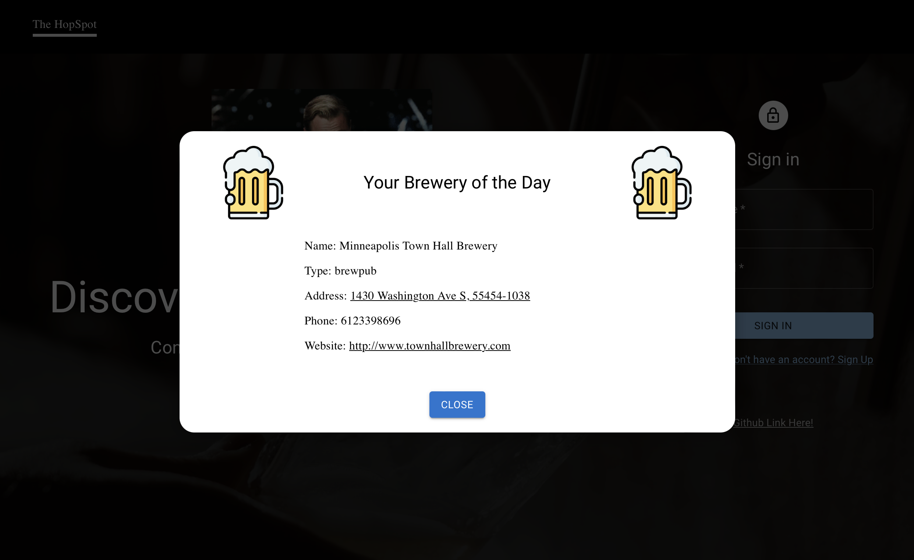
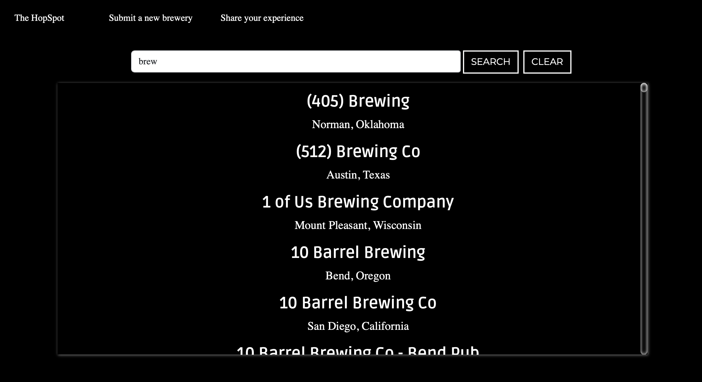
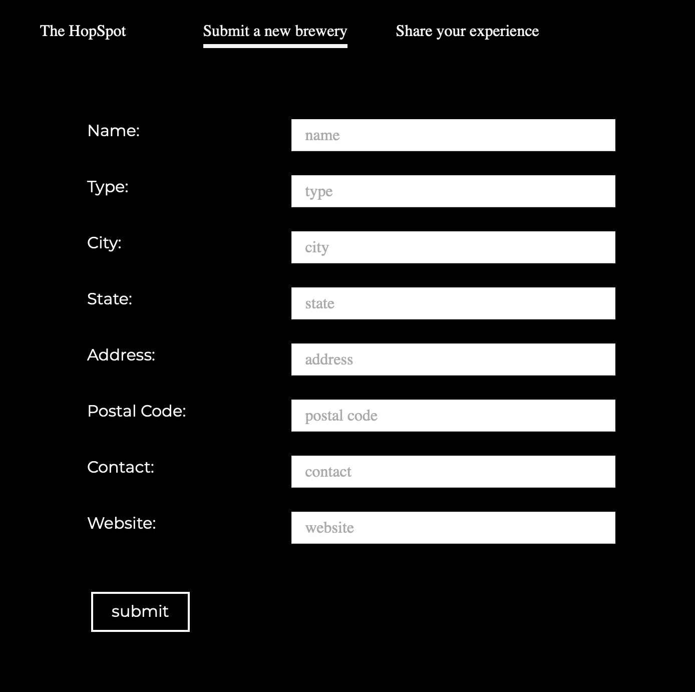

# WhereBnB

## Brews, Bars and Beyond. Find your Hoppy Place!

### Description

Welcome to Where Bars and Breweries (WhereBnB), your ultimate companion to the world of Bars and Breweries.
WhereBnB is your gateway to discovering the finest bars/breweries near you. Easily search for breweries, add your favourite places, read real-time ratings/reviews, and connect with fellow beer enthusiasts.

### Screenshots

<figure>
      
      <figcaption>Homepage</figcaption>
</figure>

<figure>
      
      <figcaption>Homepage User Logged In</figcaption>
</figure>

<figure>
      
      <figcaption>Random Brewery</figcaption>
</figure>

<figure>
      
      <figcaption>Search Brewery</figcaption>
</figure>

<figure>
      
      <figcaption>Submit New Brewery</figcaption>
</figure>

## Pre-requisites

### Codebase

-   Git clone the [code base](https://github.com/ftech-glitch/psychic-train/tree/main)
-   cd phychic-train

### Installation

Before starting development on the project, ensure that you:

Note: Ensure your .env files are added to your .gitignore

-   Create a .env file in /frontend and /WhereBnB_Server individually.

**/frontend** Environment Variables
| Variable | Desc. |
| ------ | ------- |
| VITE_SERVER=http://127.0.0.1:[PORT] | PORT is the port number your express server is listening to |

**/backend** Environment Variables
| Variable | Desc. |
| ------ | ------- |
| PORT=[PORT] | PORT is the port number your express server is listening to |
| MONGODB_URL=[URL to Database]| URL that links to your MongoDB database. The URL will differ depending on whether you are running locally, or using Atlas. |

-   Install packages in /frontend directory

From root directory,

```bash
cd frontend/
npm i
```

From root directory, 3. Install packages in /WhereBnb_Server directory

```bash
cd WhereBnB_Server/
npm i
```

## Usage

### Local Server

There are two ways to start the development servers (frontend and backend)

1. Concurrently:
    - From parent directory, type `npm run dev`.
2. Individually:
    - Open two terminals, in the first, `cd frontend` and type `npm run dev`.
    - In the other terminal `cd WhereBnB_Server` and type `npm run dev`.

## File Structure

```bash
App.jsx
├── UserContext
├── Navbar.jsx
└── Home.jsx
    ├── Sidebar.jsx
        ├── Login.jsx
        ├── SignUp.jsx
        ├── UserProfile.jsx
    ├── Add.jsx
    ├── Search.jsx
    └── RateAndReview.jsx
```

## Frontend

The frontend section's source code in split into four sub-directories, /components, /context, /hooks and /img.

**Components**

**App.jsx**

-   This serves as the parent/root directory where main.jsx and App.jsx are kept.
-   App.jsx serves as the main entry point to the React application. It sets up the overall structure of the app, including routing and providing context.
-   App.jsx stores several variables such as the Login Access Token, User Role (user/admin) and Current User Profile. These variables are provided as userContext to all child components, allowing them to access user-related data.
-   Conditional rendering is implemented through short circuiting which only exposes certain routes upon user login.

**Home.jsx**

-   Home.jsx component is responsible for rendering the home page of the application. It serves as the initial landing page where users are directed upon visiting the application.
-   This is the main parent and ancestor of all other child and sub-child components and it where the user is presented with all the features.
-   Home.jsx also provides the sidebar feature where the user can log in and view user profile.

**Sidebar.jsx**

-   The Sidebar component houses user authentication components such as Login, Signup and UserProfile.
-   This provides the user a one stop shop to log in an existing account, sign up for a new account, or access their user profile.
-   This component also enforces visibility control, where depending on the user's authentication status `accessTokenLength` and `showLogin` props are set, the Home.jsx parent shows different options.
-   It allows Home.jsx to dynamically adjust its content based on whether the user is logged in or not.

**Add.jsx**

-   The Add component allows users to add new breweries to the application.
-   Users can input information about a new brewery, such as its name, type, location, and contact details, using the form provided by the Add component.
    Upon submission, the information is sent to the backend server to add the brewery to the database.

**Search.jsx**

-   The Search component enables users to search for breweries by name.
-   Users can search for breweries by entering their names into the search bar provided by the Search component.
-   The component dynamically filters and displays the breweries that match the search query.

**RateAndReview.jsx**

-   The RateAndReview component allows users to rate and review breweries within the application.
-   It provides a form where users can select a brewery, rate it using a star rating system, and write a review.
-   Upon submission, the rating and review are sent to the backend server to be added to the database.

## Backend

#### Authorization APIs

### API Documentation

This document provides an overview of the APIs available in your application.

---

#### 1. `register`

-   **Description**: Registers a new user account.
-   **Method**: POST
-   **Endpoint**: `/register`
-   **Parameters**:
    -   `username`: User's username
    -   `email`: User's email address
    -   `gender`: User's gender
    -   `role`: User's role
    -   `password`: User's password
-   **Response**:
    -   `status`: Status of the registration process (ok or error)
    -   `msg`: Message indicating the outcome of the registration process

---

#### 2. `login`

-   **Description**: Logs in an existing user.
-   **Method**: POST
-   **Endpoint**: `/login`
-   **Parameters**:
    -   `username`: User's username
    -   `password`: User's password
-   **Response**:
    -   `access`: JWT token for accessing protected endpoints
    -   `refresh`: JWT token for refreshing the access token
-   **Additional Actions**:
    -   Updates the user's login date in the database

---

#### 3. `refresh`

-   **Description**: Refreshes the access token.
-   **Method**: POST
-   **Endpoint**: `/refresh`
-   **Parameters**:
    -   `refresh`: Refresh token
-   **Response**:
    -   `access`: New access token

---

#### 4. `getAllUser`

-   **Description**: Retrieves details of all users.
-   **Method**: GET
-   **Endpoint**: `/users`
-   **Response**: Array of user details objects including user information, profile, and authentication details.

---

#### 5. `deleteUser`

-   **Description**: Deletes a user account.
-   **Method**: DELETE
-   **Endpoint**: `/user/:id`
-   **Parameters**:
    -   `id`: User ID
-   **Response**:
    -   `status`: Status of the deletion process (ok or error)
    -   `msg`: Message indicating the outcome of the deletion process

---

#### 6. `updateUserProfile`

-   **Description**: Updates the user profile including profile picture.
-   **Method**: PUT
-   **Endpoint**: `/user/profile`
-   **Parameters**:
    -   `file`: Profile picture file (optional)
-   **Response**:
    -   `status`: Status of the update process (ok or error)
    -   `msg`: Message indicating the outcome of the update process

---

#### 7. `getUserProfile`

-   **Description**: Retrieves the profile of the logged-in user.
-   **Method**: GET
-   **Endpoint**: `/user/profile`
-   **Response**: User profile details including user information, profile, and authentication details.

---

#### 8. `favouriteBrewery`

-   **Description**: Adds a brewery to the user's favorites list.
-   **Method**: POST
-   **Endpoint**: `/user/favourite`
-   **Parameters**:
    -   `breweryid`: ID of the brewery to be favorited
-   **Response**:
    -   `status`: Status of the favoriting process (Success or error)
    -   `msg`: Message indicating the outcome of the favoriting process

---

#### 9. `unfavouriteBrewery`

-   **Description**: Removes a brewery from the user's favorites list.
-   **Method**: DELETE
-   **Endpoint**: `/user/favourite`
-   **Parameters**:
    -   `breweryid`: ID of the brewery to be unfavorited
-   **Response**:
    -   `status`: Status of the unfavoriting process (Success or error)
    -   `msg`: Message indicating the outcome of the unfavoriting process

---

#### 10. `getAllUserFavouriteBrewery`

-   **Description**: Retrieves the list of all breweries favorited by the logged-in user.
-   **Method**: GET
-   **Endpoint**: `/user/favourite`
-   **Response**: Array of brewery IDs that are favorited by the user.

---

#### Brewery APIs

### Brewery API Documentation

This README provides an overview of the Brewery APIs available in your application.

---

#### 1. `getBrewery`

-   **Description**: Retrieves all breweries from the database.
-   **Method**: GET
-   **Endpoint**: `/breweries`
-   **Response**: Array of brewery objects containing brewery details.

---

#### 2. `postBrewery`

-   **Description**: Retrieves a specific brewery from the database by name.
-   **Method**: POST
-   **Endpoint**: `/breweries/search`
-   **Parameters**:
    -   `Name`: Name of the brewery
-   **Response**: Brewery object containing details of the specified brewery.

---

#### 3. `createBrewery`

-   **Description**: Creates a new brewery and adds it to the database.
-   **Method**: POST
-   **Endpoint**: `/breweries`
-   **Parameters**:
    -   `name`: Name of the brewery
    -   `type`: Type of the brewery
    -   `city`: City where the brewery is located
    -   `state`: State where the brewery is located
    -   `address`: Address of the brewery
    -   `postal`: Postal code of the brewery
    -   `contact`: Contact information of the brewery
    -   `website`: Website URL of the brewery
-   **Response**:
    -   `status`: Status of the creation process (Success or error)
    -   `msg`: Message indicating the outcome of the creation process

---

#### 4. `patchBrewery`

-   **Description**: Updates an existing brewery based on its ID.
-   **Method**: PATCH
-   **Endpoint**: `/breweries/:id`
-   **Parameters**:
    -   `id`: ID of the brewery to be updated
    -   `Name`: Name of the brewery
    -   `Type`: Type of the brewery
    -   `City`: City where the brewery is located
    -   `State`: State where the brewery is located
    -   `Address`: Address of the brewery
    -   `Postal`: Postal code of the brewery
    -   `Contact`: Contact information of the brewery
    -   `Website`: Website URL of the brewery
-   **Response**:
    -   `status`: Status of the update process (Success or error)
    -   `msg`: Message indicating the outcome of the update process
    -   `data`: Updated brewery object

---

#### 5. `deleteBrewery`

-   **Description**: Deletes a brewery from the database based on its ID.
-   **Method**: DELETE
-   **Endpoint**: `/breweries/:id`
-   **Parameters**:
    -   `id`: ID of the brewery to be deleted
-   **Response**:
    -   `status`: Status of the deletion process (Success or error)
    -   `msg`: Message indicating the outcome of the deletion process

---

#### 6. `getRating`

-   **Description**: Retrieves ratings of a brewery by its ID.
-   **Method**: GET
-   **Endpoint**: `/breweries/:id/ratings`
-   **Parameters**:
    -   `id`: ID of the brewery
-   **Response**: Array of rating objects containing rating details.

---

#### 7. `addRating`

-   **Description**: Adds a rating for a brewery.
-   **Method**: POST
-   **Endpoint**: `/breweries/:id/ratings`
-   **Parameters**:
    -   `id`: ID of the brewery
    -   `score`: Score given to the brewery
-   **Response**:
    -   `status`: Status of the rating addition process (Success or error)
    -   `msg`: Message indicating the outcome of the rating addition process
    -   `rating`: New rating object

---

#### 8. `getReview`

-   **Description**: Retrieves reviews of a brewery by its ID.
-   **Method**: GET
-   **Endpoint**: `/breweries/:id/reviews`
-   **Parameters**:
    -   `id`: ID of the brewery
-   **Response**: Array of review objects containing review details.

---

#### 9. `addReview`

-   **Description**: Adds a review for a brewery.
-   **Method**: POST
-   **Endpoint**: `/breweries/:id/reviews`
-   **Parameters**:
    -   `id`: ID of the brewery
    -   `review`: Review text
-   **Response**:
    -   `status`: Status of the review addition process (Success or error)
    -   `msg`: Message indicating the outcome of the review addition process
    -   `review`: New review object

---

#### 10. `getAverageRating`

-   **Description**: Retrieves the average rating of a brewery by its ID.
-   **Method**: GET
-   **Endpoint**: `/breweries/:id/average-rating`
-   **Parameters**:
    -   `id`: ID of the brewery
-   **Response**:
    -   `status`: Status of the retrieval process (Success or error)
    -   `averageRating`: Average rating of the brewery

---

#### 11. `favouriteBrewery`

-   **Description**: Adds a brewery to a user's favorites list.
-   **Method**: POST
-   **Endpoint**: `/user/favourite`
-   **Parameters**:
    -   `username`: Username of the user
    -   `breweryid`: ID of the brewery to be favorited
-   **Response**:
    -   `status`: Status of the favoriting process (Success or error)
    -   `msg`: Message indicating the outcome of the favoriting process

---
